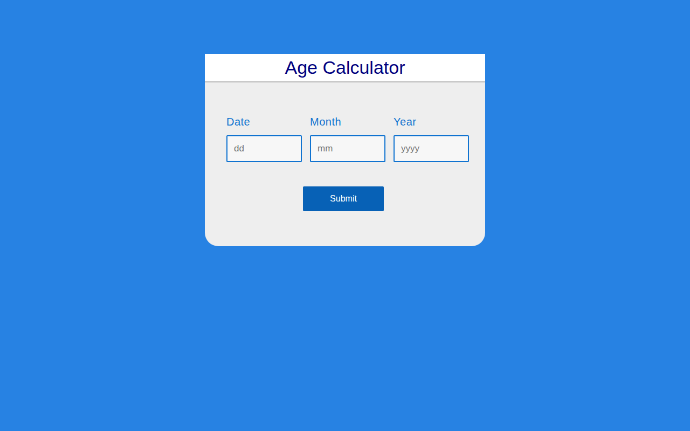

# Age Calculator

A simple, clean age calculator — enter your date of birth and instantly get your age in years, months and days.

**Live demo:** https://erionnezha.github.io/Age-Calculator/

## How it works

Enter the **day**, **month** and **year** of birth, press **Submit**, and your exact age is calculated on the spot.

## Tech

- HTML, CSS, vanilla JavaScript
- No dependencies — runs entirely in the browser

## Author

Created by **Erion Nezha**.
